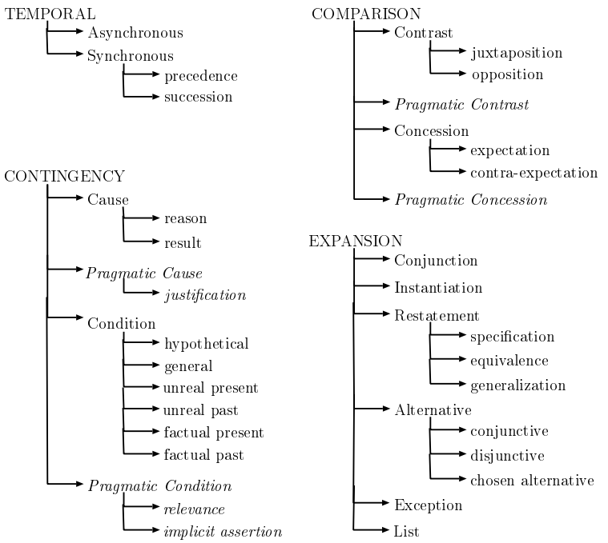

# Implicit Discourse Relation

## Data-set

### PDTB-2.0

1. [Penn Discourse TreeBank 2.0](https://www.seas.upenn.edu/~pdtb/papers/pdtb-lrec08.pdf) describing its lexically-grounded annotations of discourse relations and their two abstract object arguments over the 1 million word Wall Street Journal corpus. 

2. This data-set can be broadly characterized into __two types__: 
   * **Explicit**

     *  subordinating conjunctions (e.g., because, when, etc.)

         > E.g., Michelle lives in a hotel room, and **although** she drives a canary-colored Porsche, she hasn’t time to clean or repair it.

     *   coordinating conjunctions (e.g., and, or, etc.)

     *  discourse adverbials (e.g., for example, instead, etc.)
   * **Implicit**
     > E.g., But a few funds have taken other defensive steps. Some have raised their cash positions to record levels. **Implicit = BECAUSE** High cash positions help buffer a fund when the market falls.

   * AltLex: express an inferred elation led to a redundancy
     > E.g., Ms. Bartlett’s previous work, which earned her an international reputation in the non-horticultural art world, often took gardens as its nominal subject. **AltLex** <u>Mayhap this metaphorical connection made</u> the BPC Fine Arts Committee think she had a literal green thumb
   * EntRel: entitybased coherence

      > E.g., Hale Milgrim, 41 years old, senior vice president, marketing at Elecktra Entertainment Inc., was named president of Capitol Records Inc., a unit of this entertainment concern. **EntRel** <u>Mr. Milgrim succeeds David Berman, who resigned last month.</u>

   * NoRel: no discourse relation or entity-based relationt

3. Distribution of Relations in PDTB-2.0

   | PDTB Relations | No. of tokens |
   | :------------- | :------------ |
   | Explicit       | 18459         |
   | Implicit       | 16224         |
   | AltLex         | 624           |
   | EntRel         | 5210          |
   | NoRel          | 254           |
   | Total          | 40600         |

4. 4 major semantic classes: **TEMPORAL**, **CONTINGENCY**, **COMPARISON** and **EXPANSION**.
   

| “CLASS”       | Explicit (18459) | Implicit (16224) | AltLex (624) | Total |
| :------------ | ---------------- | ---------------- | ------------ | ----- |
| “TEMPORAL”    | 3612             | 950              | 88           | 4650  |
| “CONTINGENCY” | 3581             | 4185             | 276          | 8042  |
| “COMPARISON”  | 5516             | 2832             | 46           | 8394  |
| “EXPANSION”   | 6424             | 8861             | 221          | 15506 |
| Total         | 19133            | 16828            | 634          | 36592 |


5. Download from https://catalog.ldc.upenn.edu/LDC2008T05 / https://github.com/cgpotts/pdtb2

   suggest reading:  http://compprag.christopherpotts.net/pdtb.html

6. Implicit: 16224 or 16053 ? 

  ```python
  iterator=pdtb.CorpusReader(pdtb2.csv).iter_data(display_progress=False)
  count = 0
  for datum in iterator:
  	if datum.Relation == "Implicit" and datum.Conn2SemClass1 != None:
  	count += 1
  # print count = 171
  # When counted together as a single token, the total is 16053,
  # which accounts for 171 instances of multiple connectives
  ```

7. [Recognizing Implicit Discourse Relations in the Penn Discourse Treebank](http://www.aclweb.org/anthology/D09-1036) 

   DISTRIBUTION in Section 2-21

   | 'title'                                  | Count | Class2 Count           |
   | ---------------------------------------- | ----- | ---------------------- |
   | 'Comparison'                             | 145   |                        |
   | 'Comparison.Concession'                  | 6     |                        |
   | 'Comparison.Concession.Contra-expectation' | 166   |                        |
   | 'Comparison.Concession.Expectation'      | 24    | 196                    |
   | 'Comparison.Contrast'                    | 891   |                        |
   | 'Comparison.Contrast.Juxtaposition'      | 634   |                        |
   | 'Comparison.Contrast.Opposition'         | 131   | 1656                   |
   | 'Comparison.Pragmatic concession'        | 1     |                        |
   | 'Comparison.Pragmatic contrast'          | 4     |                        |
   | 'Contingency'                            | 3     |                        |
   | 'Contingency.Cause'                      | 1     |                        |
   | 'Contingency.Cause.Reason'               | 2032  |                        |
   | 'Contingency.Cause.Result'               | 1393  | 3426                   |
   | 'Contingency.Condition.Hypothetical'     | 1     |                        |
   | 'Contingency.Pragmatic cause.Justification' | 69    |                        |
   | 'Contingency.Pragmatic condition.Relevance' | 1     |                        |
   | 'Expansion'                              | 77    |                        |
   | Expansion.Alternative'                   | 5     |                        |
   | 'Expansion.Alternative.Chosen alternative' | 146   |                        |
   | 'Expansion.Alternative.Conjunctive'      | 8     | 159* (in paper is 158) |
   | 'Expansion.Conjunction'                  | 2974  |                        |
   | 'Expansion.Exception'                    | 2     |                        |
   | 'Expansion.Instantiation'                | 1176  |                        |
   | 'Expansion.List'                         | 345   |                        |
   | 'Expansion.Restatement'                  | 159   |                        |
   | 'Expansion.Restatement.Equivalence'      | 230   |                        |
   | 'Expansion.Restatement.Generalization'   | 163   |                        |
   | 'Expansion.Restatement.Specification'    | 2018  | 2570                   |
   | 'Temporal'                               | 1     |                        |
   | 'Temporal.Asynchronous.Precedence'       | 449   |                        |
   | 'Temporal.Asynchronous.Succession'       | 134   | 583                    |
   | 'Temporal.Synchrony'                     | 213   |                        |

## Approach
### Level-2 prediction
1. [Adversarial Connective-exploiting Networks for Implicit Discourse Relation Classification](https://arxiv.org/pdf/1704.00217.pdf)

   **Multi-classify**

   | Model                            | PDTB-Lin | PDTB-Ji |
   | -------------------------------- | -------- | ------- |
   | Word-vector                      | 34.07    | 36.86   |
   | CNN                              | 43.12    | 44.51   |
   | Ensemble                         | 42.17    | 44.27   |
   | Multi-task                       | 43.73    | 44.75   |
   | l_2-reg                          | 44.12    | 45.33   |
   | Lin et al. (2009)                | 40.20    | -       |
   | Lin et al. (2009)+Brown clusters | -        | 40.66   |
   | Ji and Eisenstein (2015)         | -        | 44.59   |
   | Qin et al. (2016a)               | 43.81    | 45.04   |
   | Ours                             | 44.65    | 46.23   |
   **four one-versus-all binary classification**
   | Model                                    | COMP. | CONT. | EXP.  | TEMP. |
   | ---------------------------------------- | ----- | ----- | ----- | ----- |
   | Pitler et al. (2009)                     | 21.96 | 47.13 | -     | 16.76 |
   | [Qin et al. (2016c)](http://anthology.aclweb.org/D/D16/D16-1246.pdf) | 41.55 | 57.32 | 71.50 | 35.43 |
   | Zhang et al. (2016)                      | 35.88 | 50.56 | 71.48 | 29.54 |
   | Zhou et al. (2010)                       | 31.79 | 47.16 | 70.11 | 20.30 |
   | Liu and Li (2016)                        | 36.70 | 54.48 | 70.43 | 38.84 |
   | Chen et al. (2016a)                      | 40.17 | 54.76 | -     | 31.32 |
   | Ours                                     | 40.87 | 54.56 | 72.38 | 36.20 |

2. [A Stacking Gated Neural Architecture for Implicit Discourse Relation Classification](http://anthology.aclweb.org/D/D16/D16-1246.pdf)

